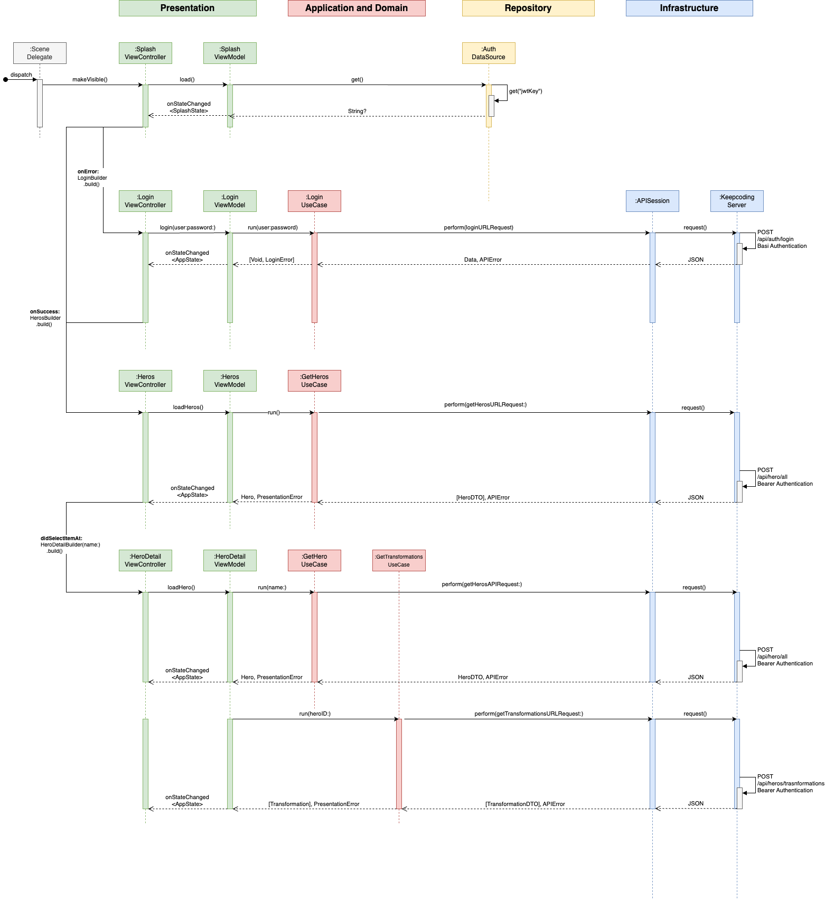

# Async iOS

# 📝 Requirements
* 	Implements the Clean Architecture, and **MVVM** design pattern in the Presentation layer
* 	Uses **CocoaCombine** for reactive UI and **Combine** for network tasks
* 	UI built with **XIBs** and **UIKit**
* 	Unit **tests** for services, persistence, use cases and view models
* 	Consumes the Dragon Ball **REST API**

# 🐾 User Stories

### Login
* Handle user input validation and errors
* Securely store the JWT using Keychain
* On app launch, check if the user is already authenticated

### Heros
* Fetch data from the API
* Show hero list

### Hero Detail
* Show hero’s name, description, photo and transformations (if applicable)

### Appearance
* Support for Light and Dark Mode

# 🧽 Clean Architecture
